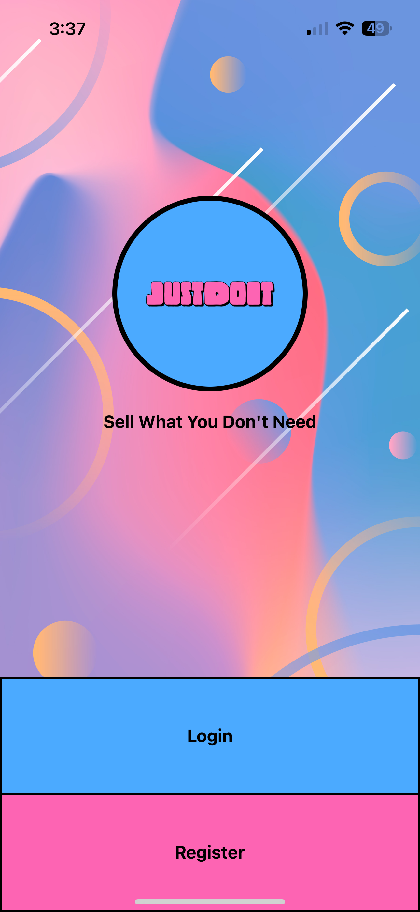

This is my first [Expo](https://expo.dev) project created with [`create-expo-app`](https://www.npmjs.com/package/create-expo-app) utilizing React Native!

The purpose of this project was to help me learn how to use React Native and build user friendly mobile interfaces.

Ended up creating the following welcome page:

  

# Credits

Background: Designed by [Freepik](https://www.freepik.com/free-vector/mobile-wallpaper-with-fluid-shapes_4954390.htm#query=app%20background&position=0&from_view=keyword&track=ais_hybrid&uuid=98a08426-80dc-49c6-8259-d3b40352191a)

Logo: Created using [Adobe Free Logo Maker](https://www.adobe.com/express/create/logo)
